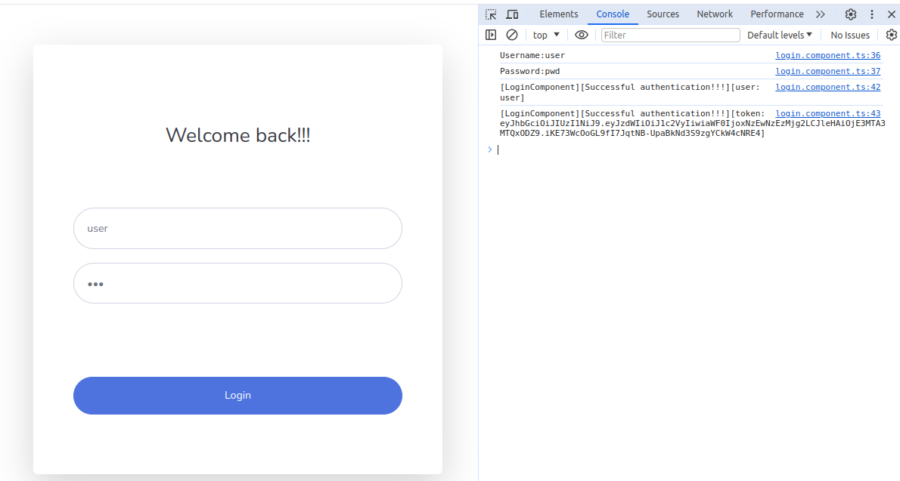
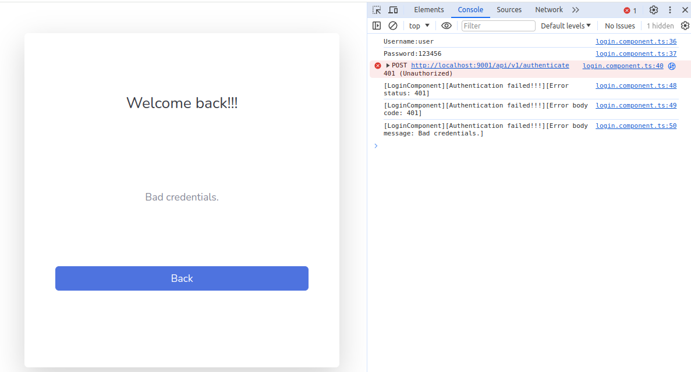

JWT AUTHENTICATION WITH ANGULAR
----------------------------------------------------------------------------------------------

Application created with Angular 14 that connects to a REST Login API.

When a user authenticates successfully a JWT Token is received from the Login API.

----------------------------------------------------------------------------------------------

Successful authentication:

----------------------------------------------------------------------------------------------

Bad credentials error:

----------------------------------------------------------------------------------------------